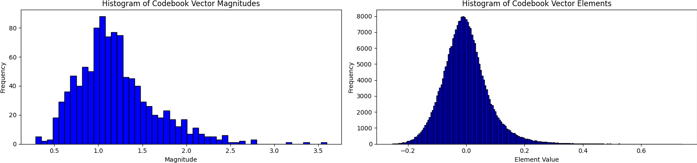

# vqgan-shh

*My lil VQGAN exercise. Uses Oxford Flowers dataset.*

This repo is not intended for public use. Just a place to store work in progress. That said, it's open and MIT-licensed, so if you find it useful, great.

## Install

```bash
pip install git+https://github.com/drscotthawley/vqgan-shh.git
```

or 

```bash
git clone https://github.com/drscotthawley/vqgan-shh.git
cd vqgan-shh
pip install -e .
```

## Run

```bash
./train-vqgan.py
```

See `./train-vqgan.py --help` for options.

## Example Outputs

After training for 6 hours on a Razer Blade 16" with a NVIDIA 4090-mobile (16 GB VRAM), we see the following results.  They're not "amazing," but perhaps training for longer will help. 


### Reconstructed Images:


Top row: Input images. Bottom row: Reconstructions.

### Codebook Vectors


## TODO:
- Add attention aka "non-local blocks"
- Make sure the GAN part is really helping/learning
  
